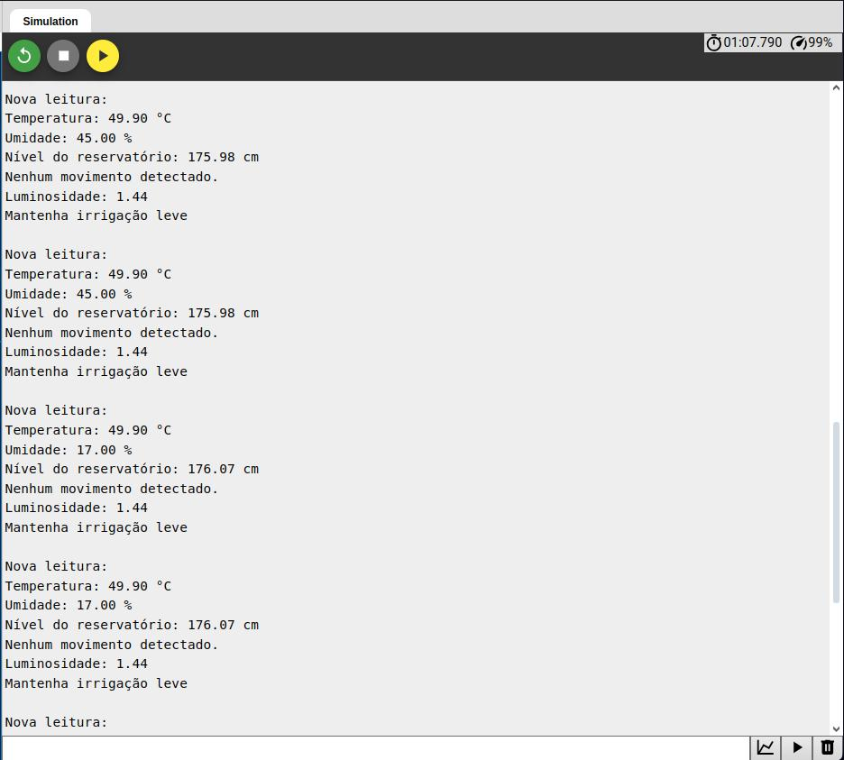

# Prints do Monitor Serial

## Descrição

Este documento contém os prints do monitor serial do Arduino, que foram utilizados para a realização do projeto.

**Objetivo:** O objetivo deste documento é apresentar os prints do monitor serial do Arduino, que foram utilizados para a realização do projeto.

**Informações mostradas:** Os prints do monitor serial do Arduino mostram informações sobre o funcionamento do projeto:

1. leitura de sensores
2. execução de ações de irrigação e acionamento dos alarmes

**Sobre os prints:** Os prints do monitor serial do Arduino estão organizados em ordem cronológica, de acordo com a execução do projeto.

## Prints

