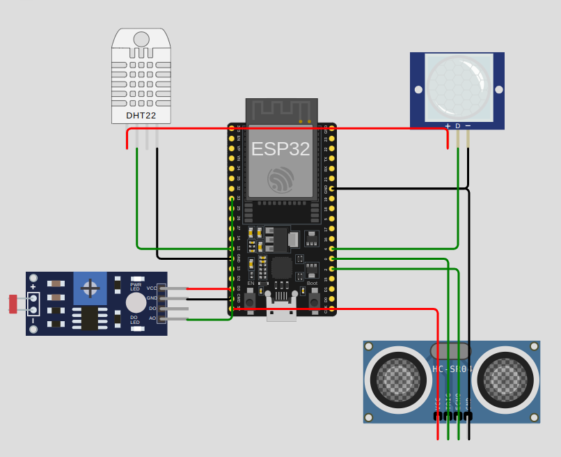

## Diagrama de Conexões dos Sensores

- **DHT22**: 
  - VCC Conectado ao pino 3.3V do ESP32.
  - SDA Conectado ao pino GPIO 12 do ESP32.
  - GND Conectado ao pino GND do ESP32.
- **HC-SR04**: 
  - VCC conectado ao pino 5V do ESP32.
  - Trig conectado ao pino GPIO 10 do ESP32. 
  - Echo conectado ao pino GPIO 2 do ESP32.
  - GND conectado ao pino GND do ESP32.
- **PIR**: 
  - VCC conectado ao pino 3.3V do ESP32.
  - OUT Conectado ao pino GPIO 4.
  - GND conectado ao pino GND do ESP32.
- **LDR**:
  - VCC conectado ao pino 5V do ESP32.
  - A0 Conectado ao pino GPIO 33 (ADC1 channel 0).
  - D0 não conectado (não utilizado).
  - GND conectado ao pino GND do ESP32.

## Imagem do Diagrama de Conexões dos Sensores

